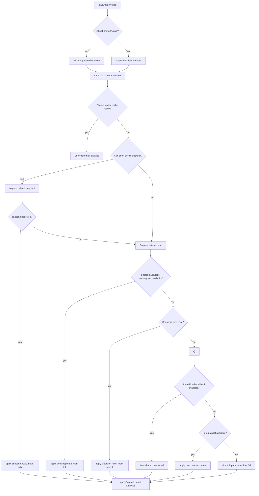

# Initial Data Loading Flow (Bubble & Line)

This note captures the current control flow for the first stage of data loading inside `bubblechart/supabase.js` and `linechart/supabase.js`. The diagrams focus on the logic that decides which dataset source (snapshot, hero, shared Supabase bootstrap, direct Supabase) is used before the UI renders any rows.

## Bubble Chart — `loadData()`

**Key checkpoints**
- Determines whether the bubble chart is the active tab via `isBubbleChartActive()`. The result (today) drives `snapshotOnlyMode` and blocks downstream Supabase hydration if the chart is not active.
- Emits `sbase_data_queried` before any fetch to log overrides, snapshot eligibility, and whether the shared loader is available.
- Prefers cached full datasets from the shared loader, then tries an immediate JSON snapshot if default mode is allowed. Snapshot success also kicks off a background `triggerBubbleHydration` if Supabase can run.
- When nothing is cached, it starts a race between a shared Supabase bootstrap and another snapshot fetch. The first winner populates the chart; Supabase wins mark the dataset “full,” while snapshots keep `hasFullDataset = false`.
- Remaining fallbacks fetch the hero dataset (partial Supabase) or run the full direct Supabase query stack. All stages update `latestDatasetSource` for analytics and hydration listeners.



## Line Chart — `loadData()`

**Key checkpoints**
- Logs snapshot eligibility + overrides, then emits `sbase_data_queried` before touching any loader.
- Checks the shared loader cache first. If empty, evaluates whether it can immediately render from the default snapshot (same gating as bubble, minus the “inactive tab” concept).
- When both a Supabase bootstrap and a snapshot are viable, it runs `waitForFirstDatasetCandidate` to race them. Supabase wins yield `datasetSource = 'shared-bootstrap'`, while snapshots keep the dataset partial.
- After the race, it retries the shared loader cache (in case bootstrap-filled it), then falls back to the hero dataset for partial Supabase hydration. Hero success triggers a background full dataset schedule.
- If all else fails, it invokes `loadDataDirectly()` to hit Supabase for pollutants, categories, and timeseries. Every successful path feeds `applyLineDataset`, potentially triggers hydration, and (until the latest change) emitted `sbase_data_loaded` analytics.

```mermaid
flowchart TD
  A[loadData invoked] --> B[track sbase_data_queried]
  B --> C{Shared loader cache ready?}
  C -- yes --> D[use cached full dataset]
  C -- no --> E{Can short-circuit snapshot?}
  E -- yes --> F[request default snapshot]
  F --> G{snapshot resolves?}
  G -- yes --> H[apply snapshot rows, partial]
  G -- no --> I
  E -- no --> I[Setup race]
  I --> J{Supabase bootstrap wins?}
  J -- yes --> K[apply bootstrap data, full]
  J -- no --> L{Snapshot wins?}
  L -- yes --> H
  L -- no --> M
  M --> N{Shared loader cache now loaded?}
  N -- yes --> D
  N -- no --> O{Hero dataset available?}
  O -- yes --> P[apply hero dataset, partial + schedule full load]
  O -- no --> Q[loadDataDirectly() → full]
  H & K & P & Q & D --> R[applyLineDataset]
  R --> S{Full dataset?}
  S -- yes --> T[mark full, emit analytics]
  S -- no --> U[trigger hydration, track partial]
```
