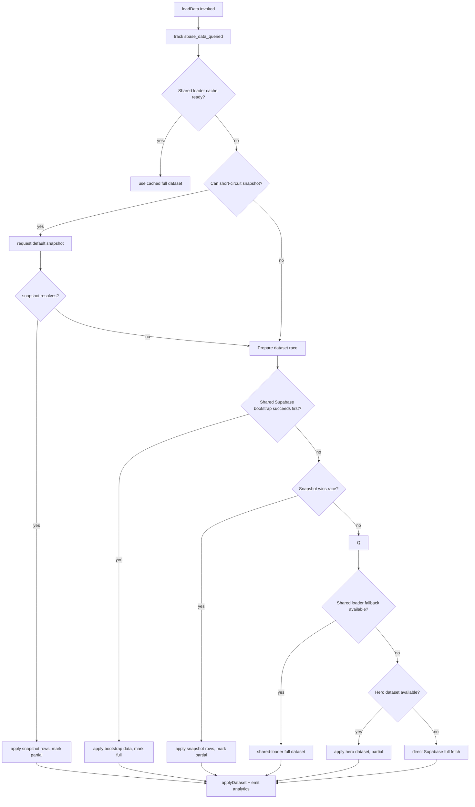
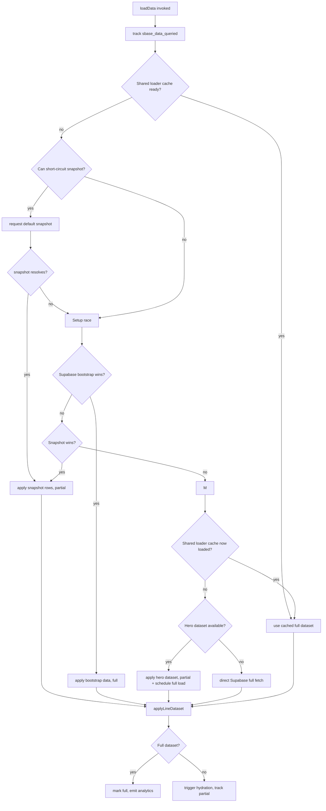

# Initial Data Loading Flow (Bubble & Line)

This note captures the current control flow for the first stage of data loading inside `bubblechart/supabase.js` and `linechart/supabase.js`. The diagrams focus on the logic that decides which dataset source (snapshot, hero, shared Supabase bootstrap, direct Supabase) is used before the UI renders any rows.

## Bubble Chart — `loadData()`

**Key checkpoints**
- Always emits `sbase_data_queried` before touching loaders so analytics can see override/snapshot eligibility.
- Prefers cached full datasets from the shared loader; cache hits now emit `sbase_data_loaded` with `source = cache` / `loadMode = full-cache`, signalling the data still originated from Supabase even though the request happened earlier.
- The race pits a shared Supabase bootstrap against the snapshot promise. Supabase wins mark the dataset "full"; snapshots keep `hasFullDataset = false` but still trigger `triggerBubbleHydration`.
- If the race does not land on Supabase, the loader continues by requesting the hero dataset, then `SharedDataLoader.loadSharedData`, and finally a direct Supabase fetch.
- Every path updates `latestDatasetSource`, merges selector metadata when partial, and reuses the shared loader’s cached payload so both charts avoid redundant queries.

## Line Chart — `loadData()`

**Key checkpoints**
- Logs snapshot eligibility + overrides, then emits `sbase_data_queried` before touching any loader.
- Checks the shared loader cache first. If empty, evaluates whether it can immediately render from the default snapshot. Cache wins now trigger `sbase_data_loaded` with `source = cache` / `loadMode = full-cache` so analytics dashboards still see a Supabase lifecycle success even though no fresh fetch occurred.
- When both a Supabase bootstrap and a snapshot are viable, it runs `waitForFirstDatasetCandidate` to race them. Supabase wins yield `datasetSource = 'shared-bootstrap'`, while snapshots keep the dataset partial but still schedule hydration.
- After the race, it retries the shared loader cache (in case bootstrap-filled it), then falls back to the hero dataset for partial Supabase hydration. Hero success schedules a background full dataset load.
- If all else fails, it invokes `loadDataDirectly()` to hit Supabase for pollutants, categories, and timeseries. Every successful path feeds `applyLineDataset` and may emit `sbase_data_loaded` when the source is Supabase-backed.

